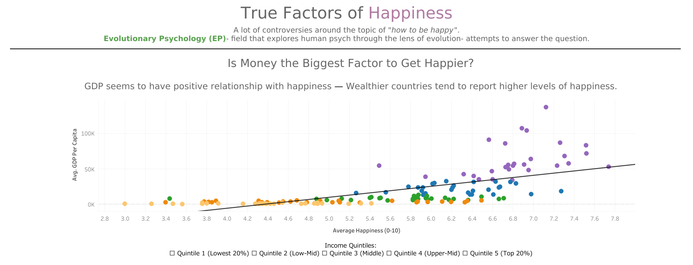
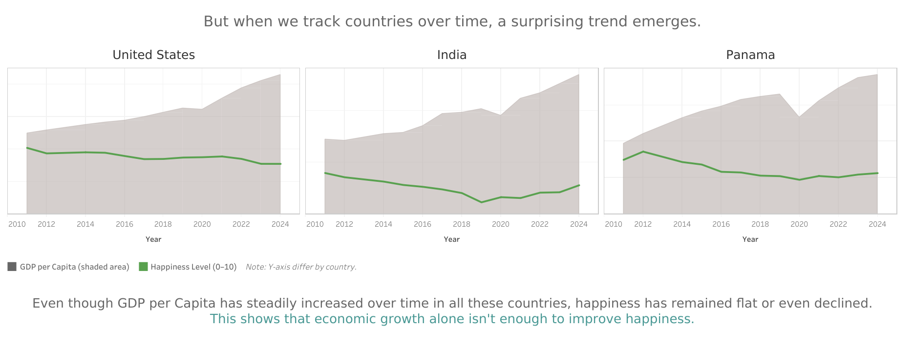
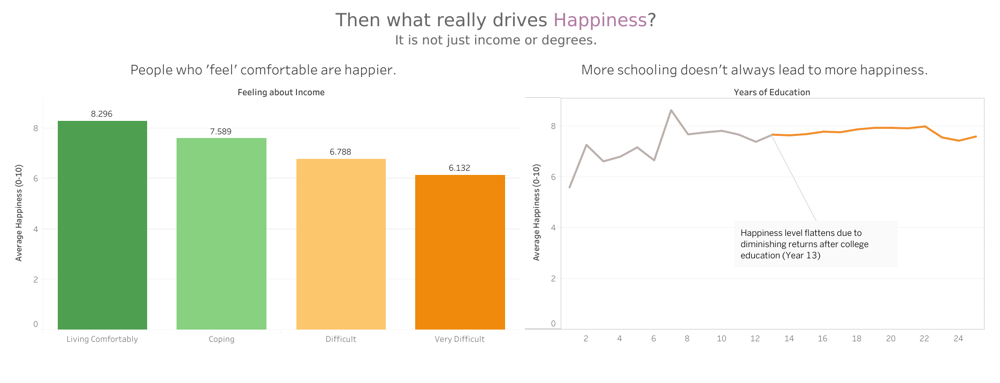
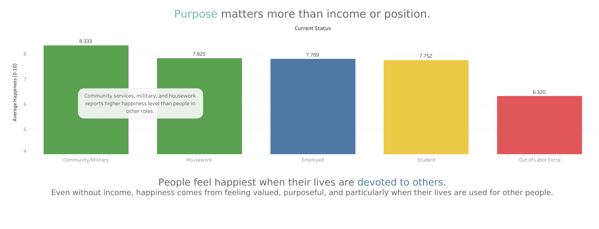
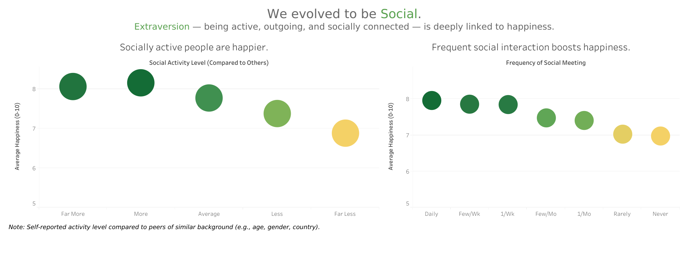
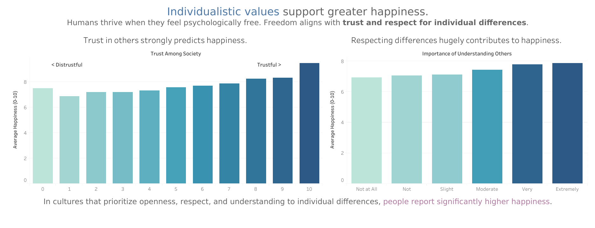

# True Factors of Happiness

What truly makes people happy? Is it income, education, status — or something deeper?  
This project explores the **real drivers of happiness**, challenging common assumptions of economic factors through **psychological** and **evolutionary** perspectives.

---

## Project Overview
- Exploring and comparing global, personal, and cultural factors to happiness.
- Uses **Evolutionary Psychology** as a motivation & framework to interpret findings.
- Integrates **GDP, survey data, and personality metrics** from multiple international sources.
- Fully interactive on [Tableau Link](https://public.tableau.com/app/profile/weongyu.jeon/viz/TrueFactorsofHappiness/Page1).

---

## Project Structure
```
True_Factors_of_Happiness/
│
├── data/
│   ├── merged_happiness_gdp_2024.csv
│   ├── 2011-2024_GDP_Happiness.csv
│   ├── ESS11_Cleaned_Final.csv
│   ├── Extraversion_vs_Happiness_By_Country.csv
│
├── images/
├── True_Factors_of_Happiness.pdf
├── True_Factors_of_Happiness.twbx
└── README.md
```

- `True_Factors_of_Happiness.twbx` — Tableau workbook (fully interactive)
- `merged_happiness_gdp_2024.csv` — GDP & WHR merged data for 2024
- `2011-2024_GDP_Happiness.csv` — Historical GDP & WHR data
- `ESS11_Cleaned_Final.csv` — Key ESS11 survey variables
- `Extraversion_vs_Happiness_By_Country.csv` — Personality & happiness data

---

## Project Background
While global reports often tie happiness to **Money**, **Evolutionary Psychology (EP)** suggests humans evolved to prioritize:
- **Social connection**
- **Purposeful roles**
- **Individual autonomy and respect**

This dashboard examines:
- **Cross-country economic indicators**- GDP per Capita data
- **Survey data from ESS Round 11**- Cultural and personality metrics (e.g., extraversion, trust)

---

## Methodology
1. **Data Collection & Cleaning**
   - Merged GDP & World Happiness Report data (2011–2024)
   - Extracted 11 key variables from European Social Survey 11 (ESS11)
2. **Visualization in Tableau**
   - Built 3 sections with different analytical lenses
   - Compared economic correlations vs. social/psychological correlations to happiness

---

## Dashboard Sections
### **Part 1: Money and Happiness**
- Global trend: Higher GDP ↔ higher happiness  
- But time-series data (USA, India, Panama) shows happiness doesn’t always increase alongside economic growth.

### **Part 2: Perception and Meaning**
- **Income feeling** (perceived comfort) matters more than actual income.
- **Purposeful roles** (students, homemakers, military) show high happiness regardless of pay.

### **Part 3: Evolutionary Roots**
- **Social activity & frequent meetings** strongly predict happiness.
- **Cultural values** like trust and respect for differences correlate with higher happiness.
- Suggests traits like **extraversion** and **freedom** align with evolved needs.

---

## Key Takeaways
✅ Income and education help gaining happiness, but only up to a point  
✅ Feeling valued, connected, and trusted drives stronger happiness gains  
✅ Cultural and social factors match our evolved needs better than pure wealth

---

## Dashboard Gallery

**Page 1**

**Page 2**

**Page 3**

**Page 4**

**Page 5**

**Page 6**


--- 

## 🔗 Links
- [Interactive Dashboard on Tableau Public](https://public.tableau.com/app/profile/weongyu.jeon/viz/TrueFactorsofHappiness/Page1)  
- [European Social Survey (ESS11, 2022)](https://europeansocialsurvey.org/news/article/third-round-11-data-release-published)  
- [World Happiness Report 2024](https://www.worldhappiness.report/data-sharing/)  
- [World Bank Open Data](https://data.worldbank.org/indicator/NY.GDP.PCAP.CD?)  
- [Big 5 Traits Dataset](https://github.com/automoto/big-five-data?utm)
